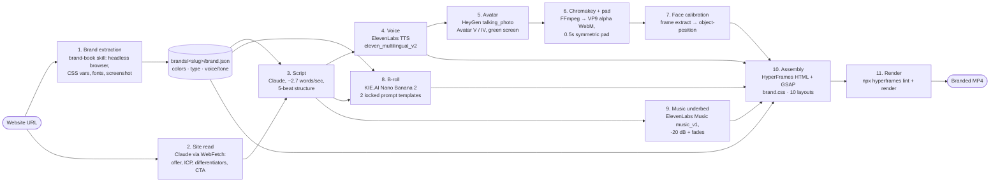

# Brand Video Pipeline


**URL in, branded explainer video out.** Give it a company's website and it produces a finished 16:9 MP4: the company's own colors and fonts, a script in its voice, a narrated AI presenter, generated B-roll and a music underbed, all assembled as an HTML/GSAP composition and rendered to video.

The orchestration lives in a Claude Code skill ([`skill/SKILL.md`](skill/SKILL.md)). An agent running the skill calls each service in turn, post-processes media with FFmpeg, edits the composition, and renders it. It is built and tested on ColdStart (coldstartb2b.com), the author's own consultancy, which is the example brand in this repo.

Demo: [`demo/coldstart-demo.mp4`](demo/coldstart-demo.mp4) (about 23 seconds, rendered by this pipeline).

## Pipeline



## Stages and services

| # | Stage | Service / model | Output |
|---|---|---|---|
| 1 | Brand extraction | `brand-book` skill (separate; not in this repo) | `brands/<slug>/brand.json`, `colors.md`, `typography.md`, `voice-tone.md`, `css-variables.json`, `reference.png` |
| 2 | Understand the business | Claude (WebFetch on homepage, services, pricing, about) | offer, buyer, 1–2 differentiators, CTA |
| 3 | Script | Claude | `script.txt`, paced at ~2.7 words/sec (22s ≈ 60 words) across Hook / Problem / Proof / How / CTA |
| 4 | Voice | ElevenLabs TTS, `eleven_multilingual_v2` | `voice.mp3` (normalized to 92% volume) |
| 5 | Avatar | HeyGen v2 `video/generate`, `talking_photo` with `use_avatar_v_model: true` (falls back to Avatar IV) | `avatar_green.mp4` on `#00FF00` |
| 6 | Key + pad | FFmpeg `chromakey` + `despill` → VP9 `yuva420p`; `tpad` 0.5s each end; voice padded to match | `avatar.webm` with alpha |
| 7 | Calibrate framing | FFmpeg frame grab, measured face position | per-layout `object-position` in `index.html` |
| 8 | B-roll | KIE.AI `nano-banana-2` (createTask → poll recordInfo) | `broll-N.png`; "abstract sculpture" or "glass chart" prompt depending on whether the line cites a number |
| 9 | Music | ElevenLabs Music `music_v1`, instrumental, length = composition | `music.mp3` mixed to -20 dB with fades |
| 10 | Assembly | HeyGen HyperFrames (HTML + GSAP timeline) | `index.html` with timed avatar / voice / music clips |
| 11 | Render | `npx hyperframes render` (headless browser frame capture + FFmpeg) | `renders/<brand>-vN.mp4` |

## How the skill orchestrates it

[`skill/SKILL.md`](skill/SKILL.md) is a Claude Code skill. Saying "Hyper Frames <url>" triggers it. The agent asks four questions (duration, voice, avatar Look, CTA), then works through the stages in order. Each API call is a `curl` against the vendor's REST endpoint with keys from `.env`. Each media step is an explicit FFmpeg command. The agent then edits the HyperFrames composition and renders it in the foreground; renders that run in the background hang. The skill also holds what was learned along the way: prompt patterns that trip KIE's safety filter, why `eleven_v3` emotion tags were dropped, why the voice must be padded only *after* HeyGen lip-sync, and a fixed v1/v2/v3 iteration loop that never overwrites earlier renders.

## Templates

`template-16x9/` is the composition (1920×1080, GSAP timeline registered on `window.__timelines["main"]`):

- `styles/brand.css` is the **only** brand-specific file. It holds the `--brand-*` tokens (bg, signal accent, display/body fonts, CTA), filled in from `brand.json`.
- `styles/template.css` holds brand-agnostic motion and type rules. It never contains a literal hex value or font name.
- `styles/layouts.css` is a 10-layout system (right-third, left-third, lower-corner avatar + B-roll, hero stat, vertical stack, horizontal bands, diagonal + B-roll, magazine spread, lower-strip avatar, full-frame avatar + lower third). Each scene picks one.
- `index.html` holds the scenes, their timings, and the avatar / voice / music clips. The checked-in version is the ColdStart composition.

`brands/coldstart/` is a complete brand: the extracted tokens and voice guide, plus `render/`, a working copy of the composition with its script and three of its generated assets. The avatar video is left out to keep the repo small, so regenerate it with stage 5 before rendering.

## Running it

Prerequisites: Node.js + npx, FFmpeg (with libvpx-vp9), [Claude Code](https://claude.com/claude-code), and API accounts for ElevenLabs, HeyGen and KIE.AI.

```bash
cp .env.example .env          # fill in keys and default voice / avatar IDs
mkdir -p ~/.claude/skills/hyperframes-pipeline
cp skill/SKILL.md ~/.claude/skills/hyperframes-pipeline/
export PIPELINE_ROOT="$PWD"
claude                        # then: "Hyper Frames https://example.com, 30s"
```

To render the bundled composition by hand once its assets are in place:

```bash
cd template-16x9
npx hyperframes lint
npx hyperframes preview       # studio editor in the browser
npx hyperframes render --output renders/coldstart-v1.mp4
```

### Required keys

| Variable | Used for |
|---|---|
| `ELEVENLABS_API_KEY` | narration (TTS) and music |
| `ELEVENLABS_VOICE_ID` | default narrator voice |
| `HEYGEN_API_KEY` | avatar generation and asset upload |
| `HEYGEN_TALKING_PHOTO_ID` | default avatar Look |
| `KIE_AI_API_KEY` | B-roll images (Nano Banana 2) |

HyperFrames itself renders locally and needs no key.

## Tests

- Run `node --test tests/*.test.mjs` (Node 20+; nothing to install). No API calls and no rendering.
- The repo is mostly a skill and a composition, so the suite validates their contracts: skill frontmatter, `brand.json` tokens matching `brand.css`, every `--brand-*` variable defined, and no literal colors or fonts in `template.css`/`layouts.css`.
- It also checks the composition: each scene layout has CSS and an avatar slot, clips fit the duration, the GSAP timeline is registered as `window.__timelines["main"]`, inline scripts parse and referenced files exist.
- CI runs the same command on every push and pull request (`.github/workflows/tests.yml`).

## Credits and scope

- **HyperFrames is HeyGen's open-source framework** ([heygen-com/hyperframes](https://github.com/heygen-com/hyperframes), [docs](https://hyperframes.heygen.com/introduction)). The `hyperframes` CLI, the composition format, and the scaffold files in `template-16x9/` (`AGENTS.md`, `CLAUDE.md`, `DESIGN.md`, `hyperframes.json`) come from it. This repo is a pipeline built on top of it.
- **HeyGen's own agent skills are not included.** Install them separately with `npx skills add heygen-com/hyperframes`.
- The `brand-book` extraction skill used in stage 1 is a separate tool and is not included. Any process that writes a `brand.json` with palette, typography and voice works.
- Third-party services (ElevenLabs, HeyGen, KIE.AI) are subject to their own terms; generated media in `brands/coldstart/` and `demo/` was produced through them.

Author: John Freund.
